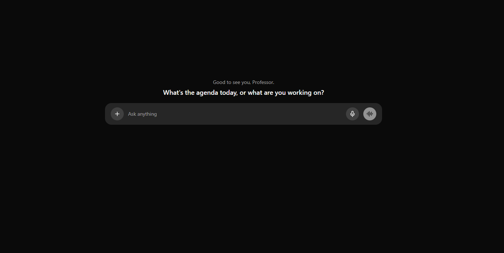

# Vision AI Studio

Vision AI Studio is a cutting-edge platform for building and deploying AI-powered computer vision applications with ease. Built with Next.js and powered by state-of-the-art AI models, it provides a seamless experience for developers to create, train, and deploy computer vision models.



## ✨ Features

- 🚀 **AI-Powered Vision Models**: Leverage the latest in computer vision AI
- 🎨 **Intuitive Interface**: User-friendly dashboard for managing your AI models
- ⚡ **Real-time Processing**: Process images and videos in real-time
- 🔒 **Secure & Private**: Your data remains yours, with robust security measures
- 🌐 **API Access**: Easy integration with your existing applications

## 🚀 Getting Started

### Prerequisites

- Node.js 18+ and npm/yarn/pnpm
- Git
- A modern web browser

### Installation

1. Clone the repository:

   ```bash
   git clone https://github.com/lwshakib/vision-ai-studio.git
   cd vision-ai-studio
   ```

2. Install dependencies:

   ```bash
   npm install
   # or
   yarn install
   # or
   pnpm install
   ```

3. Set up environment variables:

   ```bash
   cp .env.example .env.local
   # Update the environment variables in .env.local
   ```

4. Run the development server:

   ```bash
   npm run dev
   # or
   yarn dev
   # or
   pnpm dev
   ```

5. Open [http://localhost:3000](http://localhost:3000) in your browser.

## 🛠️ Tech Stack

- **Frontend**: Next.js 14, React 18, TypeScript, Tailwind CSS
- **Backend**: Next.js API Routes, Prisma
- **AI**: @ai-sdk/google, @ai-sdk/groq, @google/generative-ai
- **Database**: PostgreSQL with Prisma ORM
- **Authentication**: Clerk
- **UI Components**: Radix UI, shadcn/ui

## 🤝 Contributing

We welcome contributions! Please read our [Contributing Guide](CONTRIBUTING.md) to get started.

## 📝 License

This project is licensed under the MIT License - see the [LICENSE](LICENSE) file for details.

## 🙏 Acknowledgments

- [Next.js](https://nextjs.org/) for the amazing React framework
- [Vercel](https://vercel.com/) for deployment
- The open-source community for their invaluable contributions
