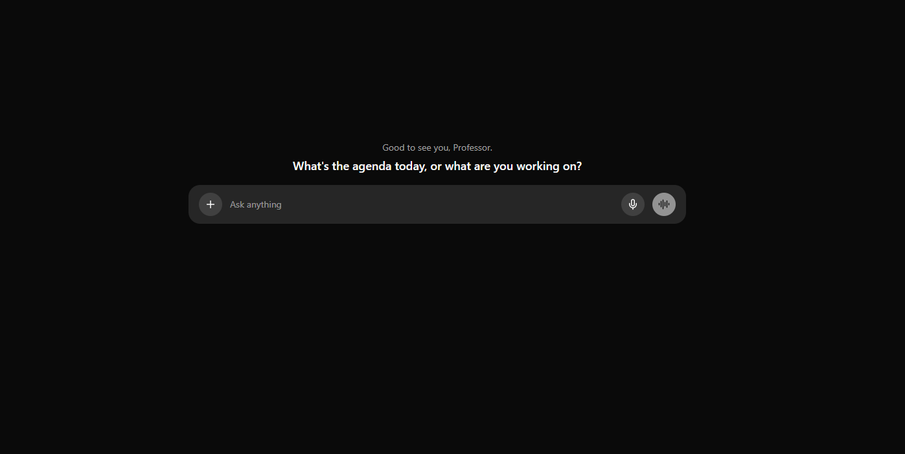
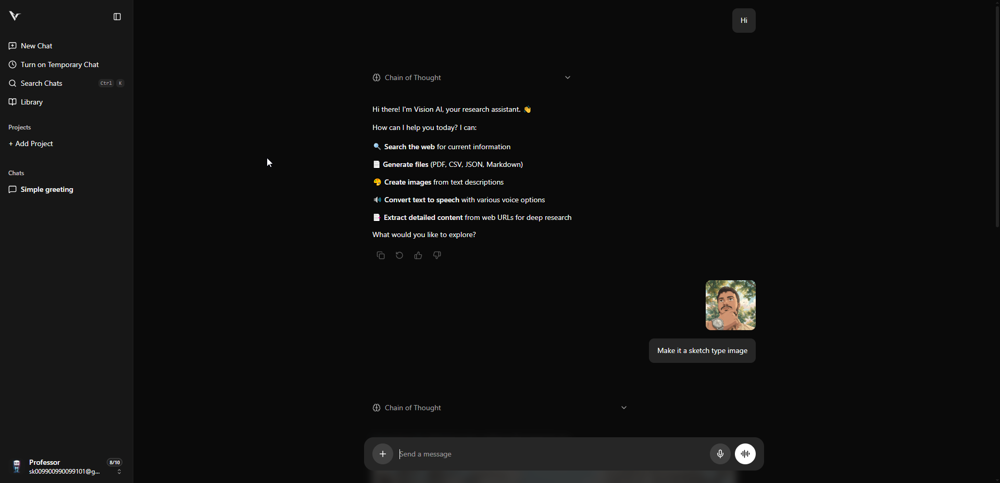
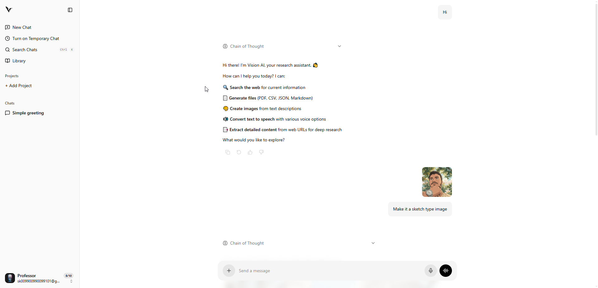
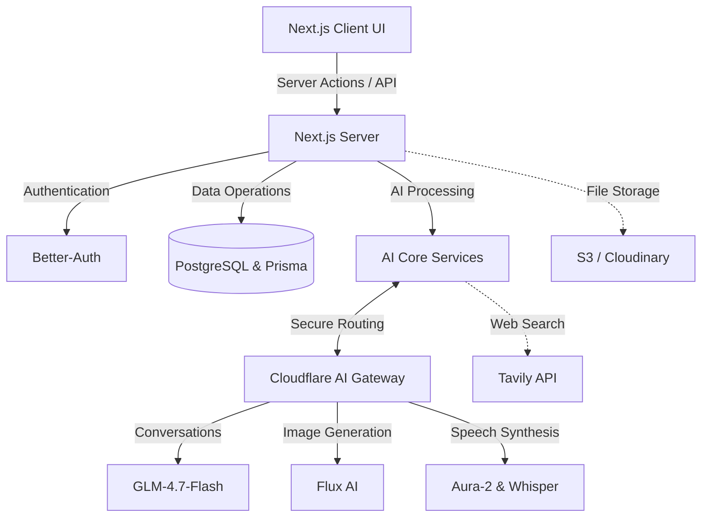

#  Vision Agentic AI

Vision Agentic AI is a high-performance, state-of-the-art agentic AI platform built with **Next.js 16**, **React 19**, and **Bun**. It provides a sophisticated suite of AI tools, including real-time web exploration, automated deep content extraction, high-quality image generation using FLUX models, and natural voice synthesis.





## ✨ Key Features

- 🤖 **Multi-Modal Agentic Chat**: Context-aware AI interactions powered by **GLM-4.7-Flash**, supporting text-to-image, speech-to-text, and more.
- 🔍 **Real-time Web Intelligence**: Integrated **Tavily AI** for up-to-the-minute web searches and deep content extraction from any URL.
- 🎨 **FLUX-Powered Image Generation**: Generate stunning visuals using **FLUX.2 [klein] 9B** models directly within your conversation flow.
- 🎙️ **Voice & Audio Intelligence**: Natural-sounding Text-to-Speech (TTS) via **Aura-2** and real-time Speech-to-Text (ASR) via **Whisper** for voice interactions.
- 📂 **Workspace & Project Management**: Organize specialized chats into dedicated projects with full context retention.
- 📄 **Dynamic File Generation**: Generate downloadable PDF, CSV, JSON, or Markdown files based on AI analysis.
- 🔒 **Secure Authentication**: Enterprise-grade user accounts and session management via **BetterAuth**.
- 🖼️ **Media Asset Library**: Centralized management for all generated and uploaded images, powered by **Cloudinary**.
- ⚡ **Optimistic & Fluid UI**: High-performance interface with immediate feedback, powered by **Framer Motion** and **Radix UI**.
- 🌗 **Adaptive Design System**: Fully responsive design with System, Light, and Dark mode support.

## 🚀 Getting Started

### Prerequisites

- [Bun](https://bun.sh/) (recommended) or [Node.js](https://nodejs.org/) 18+
- [PostgreSQL](https://www.postgresql.org/) database
- [Git](https://git-scm.com/)

### Installation

1. **Clone the repository**:

   ```bash
   git clone https://github.com/lwshakib/vision-agentic-ai.git
   cd vision-agentic-ai
   ```

2. **Install dependencies**:

   Ensure you have [Bun](https://bun.sh/) installed. If not, follow the official installation guide. Then, run:

   ```bash
   bun install
   ```

3. **Set up environment variables**:

   Create a copy of the example environment file:

   ```bash
   cp .env.example .env
   ```

   Open the `.env` file and configure the required keys. Some key variables include:
   - **Authentication**: `BETTER_AUTH_SECRET` (generate a secure random string), `GOOGLE_CLIENT_ID`, and `GOOGLE_CLIENT_SECRET`.
   - **Database**: `DATABASE_URL` for your PostgreSQL instance.
   - **External APIs**: `TAVILY_API_KEY` and `RESEND_API_KEY`.
   - **Cloudflare AI Gateway**: `CLOUDFLARE_AI_GATEWAY_API_KEY` and `CLOUDFLARE_AI_GATEWAY_ENDPOINT`.
   - **Media Storage**: Setup your AWS S3 or Cloudflare R2 bucket variables like `AWS_ACCESS_KEY_ID`, `AWS_SECRET_ACCESS_KEY`, and `AWS_S3_BUCKET_NAME`.

4. **Initialize the database**:

   Set up your PostgreSQL database schema with Prisma:

   ```bash
   bun run db:migrate
   ```

5. **(Optional) Storage Bucket Setup**:

   If using S3 or Cloudflare R2, you can initialize your buckets:

   ```bash
   bun run bucket:setup
   ```

6. **Run the development server**:

   ```bash
   bun run dev
   ```

7. Open [http://localhost:3000](http://localhost:3000) in your browser.

## 🛠️ Tech Stack

- **Runtime & Tooling**: [Bun](https://bun.sh/), [TypeScript](https://www.typescriptlang.org/)
- **Frontend**: [Next.js 16](https://nextjs.org/), [React 19](https://react.dev/), [Tailwind CSS 4](https://tailwindcss.com/)
- **State Management**: [Zustand](https://github.com/pmndrs/zustand)
- **Database & ORM**: [PostgreSQL](https://www.postgresql.org/), [Prisma](https://www.prisma.io/)
- **Authentication**: [Better-Auth](https://better-auth.com/)
- **AI Models & Infrastructure**: [GLM-4.7-Flash](https://github.com/THUDM/GLM-4), [Tavily AI](https://tavily.com/), [Flux AI](https://fal.ai/models/fal-ai/flux/schnell)
- **Audio Intelligence**: Aura-2 (TTS) & Whisper Large v3 Turbo (ASR)
- **Image Hosting**: [Cloudinary](https://cloudinary.com/)
- **UI Components**: [Radix UI](https://www.radix-ui.com/), [shadcn/ui](https://ui.shadcn.com/), [Framer Motion](https://www.framer.com/motion/)
- **Email**: [Resend](https://resend.com/), [React Email](https://react.email/)

## 🏗️ Architecture


```mermaid
graph TD
    Client[Next.js Client UI] -->|Server Actions / API| Server[Next.js Server]
    Server -->|Authentication| Auth[Better-Auth]
    Server -->|Data Operations| DB[(PostgreSQL & Prisma)]
    Server -->|AI Processing| AICore[AI Core Services]
    
    AICore <-->|Secure Routing| Gateway[Cloudflare AI Gateway]
    Gateway -->|Conversations| GLM[GLM-4.7-Flash]
    Gateway -->|Image Generation| FLUX[Flux AI]
    Gateway -->|Speech Synthesis| Audio[Aura-2 & Whisper]
    
    AICore -.->|Web Search| Tavily[Tavily API]
    Server -.->|File Storage| Storage[S3 / Cloudinary]
```

## 📂 Project Structure
- **`actions/`**: Server-side logic for data mutations and external API integrations.
- **`app/`**: Next.js App Router structure (Auth, Main workspace, API routes).
- **`components/`**: Modular React components (AI elements, Chat system, UI primitives).
- **`llm/`**: AI core logic – tool definitions, system prompts, streaming, and model configs.
- **`lib/`**: Shared utilities, database clients, authentication setup, and constants.
- **`prisma/`**: Database schema modeling and migration history.
- **`public/`**: Static assets (logos, screenshots, icons).

## 🤝 Contributing

We welcome contributions! Please see our [Contributing Guide](CONTRIBUTING.md) to get started and review our [Code of Conduct](CODE_OF_CONDUCT.md).

## 📝 License

This project is licensed under the MIT License - see the [LICENSE](LICENSE) file for details.

## 🙏 Acknowledgments

- [Next.js](https://nextjs.org/) & [Vercel](https://vercel.com/) for the framework and hosting.
- The open-source community for the incredible tools used in this project.
